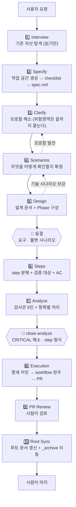
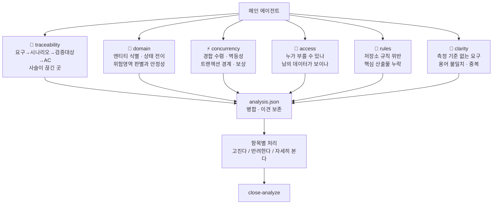
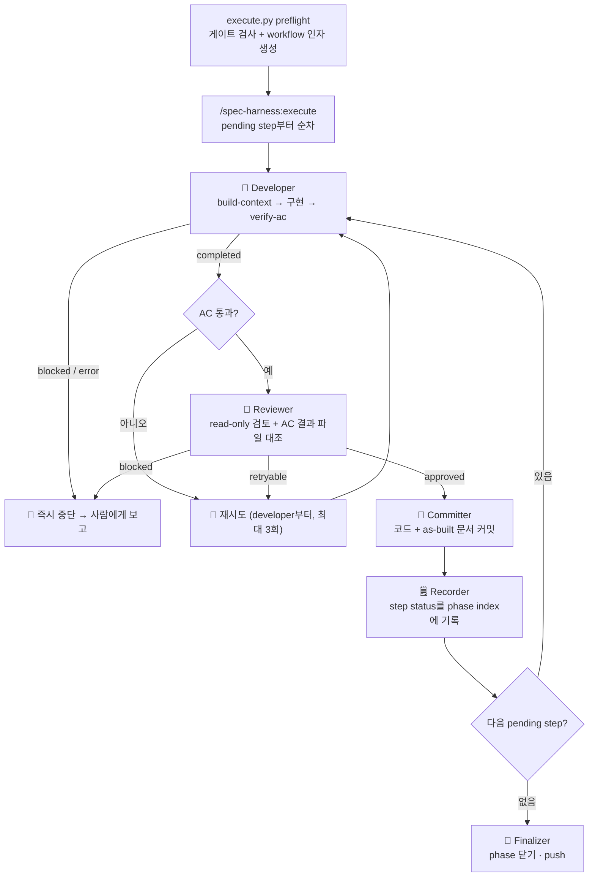
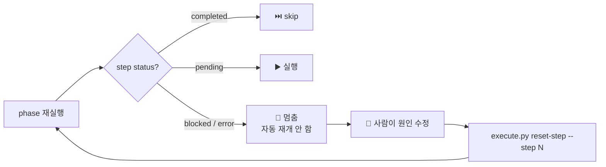

# 🧭 spec-harness

명세를 먼저 확정하고, 그 명세가 구현을 끌고 가는 **SDD(Spec-Driven Development) 하네스**. Claude Code 플러그인으로 배포한다.

---

## 🎯 무엇을 하나

바로 코드를 짜지 않는다. 먼저 명세를 세우고, 모호한 곳은 추측으로 메우지 않고 사용자와 확정한 뒤, **확정된 명세만** 자동 실행으로 넘긴다. 명세가 상류, 코드가 하류다.

세 가지가 이 하네스의 성격을 정한다.

- **위험영역은 가정하지 않는다.** 틀리면 데이터·돈·접근권한·외부 계약이 깨지는 곳(결제·인증·데이터 모델·상태 전이)은 기본값으로 메우지 않고 사용자와 확정한 뒤에만 넘어간다.
- **통과 기준이 말이 아니라 실행 명령이다.** 각 step의 Acceptance Criteria는 실제로 돌려 exit code로 판정한다.
- **구현자와 검증자가 분리돼 있다.** 구현한 에이전트의 자기보고를 다른 에이전트가 파일과 대조한다.

### 💡 구조를 여는 열쇠 하나

실행 단계의 오케스트레이터는 **dynamic workflow(JavaScript)**다. 이 JS는 shell·git·파일시스템을 직접 다루지 못하고, `agent()`로 서브에이전트를 띄워 그 반환값으로 분기할 뿐이다. 그래서 AC 실행·git 커밋·상태 기록·마무리는 전부 **에이전트가 `execute.py` 서브커맨드를 통해** 대신 수행한다. 이 한 줄이 아래 구조 대부분을 설명한다.

---

## 🗺️ 전체 흐름 (10 Stage)



성격이 다른 **세 묶음**으로 나뉜다.

| 묶음 | Stage | 성격 |
| --- | --- | --- |
| 🧠 **명세** | 1 Interview · 2 Specify · 3 Clarify · 4 Scenarios · 5 Design | 사람이 주도해 무엇을 어떻게 만들지 확정한다. 끝에서 **동결**된다 |
| 🔧 **변환·검증** | 6 Steps · 7 Analyze | 확정된 명세를 기계가 실행할 단위로 옮기고 대조한다. **다시 만들어도 되는** 산출물 |
| 🤖 **실행** | 8 Execution · 9 PR Review · 10 Root Sync | 기계가 구현하고 사람이 리뷰하며 루트에 반영한다 |

명세 묶음은 며칠에 걸쳐 오갈 수 있어 **한 세션에 다 끝내지 않아도 된다.** spec 레벨 `workflow-checklist.json` 하나가 진행을 추적하고, `completed`가 아닌 첫 단계부터 재개한다.

**되돌아오는 길은 정상 동작이다.** 시나리오를 쓰다 모호함이 드러나면 Clarify로 돌아가고, 설계가 경합·복구 시나리오를 드러내면 Scenarios를 보강한다. 순서가 이런 이유는 **검증이 설계를 끌고 가야 하고, 설계가 검증을 정해선 안 되기** 때문이다.

---

## 🚦 게이트 — 무엇이 실제로 막나

게이트는 조건을 만족하지 못하면 다음으로 넘어가지 않는 지점이다. **무엇이 그것을 막는지**가 게이트마다 다르다.

| 단계 | 게이트 | 누가 막나 |
| --- | --- | --- |
| Clarify(3) | 위험영역 마커가 하나도 안 남았다 | 메인 에이전트 |
| Scenarios(4) | 확인 방법 없는 요구·완료 기준이 없다 | 메인 에이전트 |
| Design(5) | 원칙 점검 · 동결 고지 | 메인 · 사용자 |
| **Analyze(7)** | **CRITICAL 중 근거 있는 반려가 아닌 것이 없다** | 🔒 `close-analyze` |
| **Analyze(7)** | **모든 step에서 AC와 검증 대상이 파싱된다** | 🔒 `close-analyze` |
| **Execution(8)** | **Analyze를 닫은 뒤 문서가 안 바뀌었다** | 🔒 `preflight` |
| Execution(8) | 1~7이 모두 `completed`다 | 🔒 `preflight` |
| Execution(8) | AC 각 명령의 exit code가 기대값과 같다 | `verify-ac` 실행 → `reviewer` 대조 |
| Execution(8) | reviewer 판정이 `approved`다 | `execute.js` |
| Execution(8) | 한 step의 시도가 3회를 넘지 않는다 | 🔒 `execute.js` |
| Execution(8) | 중단된 step은 `pending`으로 되돌려야 재개된다 | 🔒 `execute.js` |
| **Root Sync(10)** | **Root Sync가 끝났고 `_archive` 승격본이 커밋됐다** | 🔒 PreToolUse hook (agent의 Bash 머지 한정) |

🔒 표시는 **모델 판단이 끼지 않는** 게이트다. 스크립트가 파일·문서 해시·파서 결과·git 상태를 직접 보고 판정한다.

> ⚠️ **AC 통과 게이트만은 다르게 읽어야 한다.** `verify-ac`가 명령을 실제로 돌려 결과를 파일에 남기는 것은 맞지만, `execute.js`는 파일을 읽을 수단이 없어 developer가 반환한 값을 본다. 그것을 파일과 대조하는 것이 바로 아래 reviewer의 역할이다 — **두 게이트는 짝이며, 대조를 빠뜨리면 AC를 통과하지 않은 코드가 커밋까지 간다.**

---

## 🧊 동결 — 무엇이 불변인가

동결은 **명세 묶음을 나갈 때(Design 통과) 한 번** 일어난다.

| 대상 | 동결 | 이후 |
| --- | --- | --- |
| 요구·완료 기준 | ✅ | 읽기만 한다. 바꾸려면 명세 묶음으로 되돌아간다 |
| `불변` 시나리오 | ✅ | **계약이다.** 구현이 어렵다는 이유로 고치지 않는다 |
| `유동` 시나리오 | ❌ | 구현 방식이 바뀌면 함께 바뀔 수 있다 |
| 설계 문서 | ❌ | 코드가 달라지면 실제 구현된 대로 갱신한다 |
| phase·step·AC | ❌ | 실행이 막히면 재분해할 수 있다 |

가르는 기준은 **틀렸을 때 무엇이 깨지는가**다. 요구·불변 시나리오가 흔들리면 만들던 것이 달라지고, 분해가 틀린 것은 다시 나누면 된다.

---

## 📐 작업 단위

| 단위 | 뜻 |
| --- | --- |
| **spec** | 최상위. `spec.md` 하나가 정점이고 spec 폴더 하나가 한 spec |
| **phase** | spec 안에서 한 번 통합·검증할 덩어리. 기본 1개(`1-main`) |
| **step** | phase 안의 구현 단위. **커밋 1개**에 대응하고 자기완결적 AC를 가진다 |

**Stage**(전체 진행 1~10)와 위 단위는 다른 축이다. Stage 8 "안에서" workflow가 한 spec의 phase·step들을 순차 실행하는 포함 관계다.

이름은 spec-kit 계보에서 왔다. spec-kit의 feature가 이 하네스의 **spec**, `tasks.md`의 한 task가 **step**이다. spec-kit의 "task"는 최하위 실행을 뜻해 이 하네스의 최상위 단위와 충돌하므로 최상위를 spec으로 부른다. **phase**는 spec-kit에 대응이 없는 이 하네스 고유의 중간 통합 묶음이다.

---

## 🧩 구성

### 3층

- **엔진** — 방법론 무관 프로세스. `skills/`(진입) + `agents/`(역할) + `workflows/`(실행 오케스트레이션)
- **방법론(opt-in)** — `methodologies/<name>/`. 켜면 그 방법론의 검사·에이전트·템플릿이 얹힌다
- **인스턴스** — 각 저장소가 제공한다. 규칙 문서, 활성 방법론, 브랜치 모델. 플러그인에는 담지 않는다

### 구성 요소

| | 무엇 |
| --- | --- |
| 📖 **skill `guide`** | 안내(`/spec-harness:guide`). 사용자가 겪을 흐름 — 개입 지점, 자동 구간, 막혔을 때 할 일 |
| 🎬 **skill `run`** | 진입점(`/spec-harness:run`). 10단계를 지휘한다. 상세 동작·데이터 계약의 정본 |
| ⚙️ **workflow `execute`** | 실행 오케스트레이터(`/spec-harness:execute`). step마다 구현→검증→검토→커밋→기록 |
| 🔍 **검사관 6인** | `analyzer-traceability`·`-domain`·`-concurrency`·`-access`·`-rules`·`-clarity` |
| 🤖 **실행 에이전트** | `developer`·`reviewer`·`committer`·`recorder`·`finalizer` |
| 🧪 **`methodologies/`** | opt-in 방법론(`ddd`·`bdd`). manifest 하나로 자기 기여물을 밝힌다 |
| 🪝 **hooks** | 진행 로그 기록 + 루트 동기화 전 머지 검사. 진행 중인 spec이 없으면 아무것도 하지 않는다 |

---

## 🔍 Analyze — 관점이 다른 여섯이 동시에 본다

한 에이전트가 열 가지를 한 번에 보면 뒤쪽이 얕아진다. 그래서 **전문성별로 나눠 동시에 띄우고**, 각 발견 유형은 **정확히 한 검사관에게만** 배정한다(두 곳에 두면 규칙이 갈라진다).



공통 규칙(read-only·입력·심각도·반환 형식)은 `references/analysis-contract.md` **한 곳**에 두고 여섯이 그것을 읽는다.

### 🤝 이견을 지우지 않는다

같은 지점을 여럿이 지적하면 하나로 합치되 각자의 심각도를 함께 남기고, `severity`는 그중 가장 높은 것으로 둔다. **심각도가 엇갈리면 그 사실을 지운 채 합치지 않는다** — 다관점 검사의 가치는 이견이 드러나는 데 있다. 처리 단계에서 누가 무엇을 다르게 봤는지 먼저 알린 뒤 선택지를 준다.

### ✅ 항목별 처리

CRITICAL·HIGH를 하나씩 처리하고 결과를 `analysis.json`에 남긴다.

| 선택 | 기록 | 뜻 |
| --- | --- | --- |
| 고친다 | `{"kind": "fixed"}` | 문서를 고치고 Analyze를 다시 돈다 |
| 반려한다 | `{"kind": "rejected", "reason": "..."}` | **근거 없이는 기록하지 않는다** |
| 자세히 본다 | 없음 | 무엇이 어떻게 깨지는지 설명하고 다시 묻는다 |

`close-analyze`는 **`fixed`도 막는다.** "고치기로 했다"는 의사일 뿐이고, 해소는 **다시 분석해 그 발견이 사라지는 것**으로만 확인된다. 닫으면서 그 시점 문서의 해시를 남겨, 이후 문서가 바뀌면 preflight가 낡은 분석을 잡는다.

---

## ⚙️ Execution 내부 파이프라인



한 step의 한 시도는 **developer → AC확인 → reviewer → committer → recorder** 전체다. 재시도는 모두 developer부터 다시 돌고, **step당 최대 3회**다. 3회 안에 끝나지 않으면 그 step에서 멈춰 사람에게 보고한다.

AC 결과 파일은 덮어쓰지 않고 시도별로 누적되어, reviewer의 대조와 사후 분석의 자료가 된다.

---

## ♻️ 재개 — 중단된 step은 자동 재개하지 않는다



원인을 안 고친 채 재실행하면 같은 실패를 반복하며 토큰만 낭비한다. 그래서 사람이 명시적으로 `pending`으로 되돌려야 재개된다 — 이때 에이전트를 하나도 부르지 않고 즉시 멈추므로 낭비가 0이다.

---

## 🔒 Root Sync 전 머지 검사

작업 폴더는 Root Sync에서 `_archive/`로 옮겨진다. **루트 문서 갱신과 그 옮김이 끝나기 전에 머지되면 명세 기록이 작업 폴더째로 남아 정리되지 않는다.** PreToolUse hook이 agent의 `gh pr merge`를 가로채 두 가지를 함께 본다.

| 무엇을 보나 | 왜 |
| --- | --- |
| checklist의 Root Sync가 `completed`인가 | 단계가 끝났는지 |
| `_archive/pr-N-<spec>/spec.md`가 **HEAD에 커밋됐는가** | 상태는 메인 에이전트가 찍는 값이라, 승격을 건너뛴 채 `completed`로 찍힐 수 있다 |

staging만 한 사본은 통과하지 못한다 — 커밋되지 않은 파일은 PR에 올라가지 않기 때문이다.

**무엇을 할지는 저장소가 정한다** — `.spec-harness/config.json`의 `merge.agent`.

| 값 | Root Sync가 남았을 때 | 그 밖의 머지 |
| --- | --- | --- |
| **없음 (기본)** · `ask` | 🟡 사용자에게 확인을 띄운다 | 통과 |
| `root_sync` | 🔴 거절 | 통과 |
| `deny` | 🔴 거절 | 🔴 거절 (agent는 머지하지 않는다) |

기본값이 막지 않고 묻기만 하는 이유는, 이 hook이 플러그인을 켠 모든 세션에 걸리기 때문이다. 하네스를 쓰지 않는 저장소에는 읽을 checklist가 없어 아무 일도 일어나지 않는다.

> ⚠️ **어느 값이든 이 판정은 agent에게만 걸린다.** hook은 agent의 Bash 도구 호출만 보므로, **사람이 GitHub 웹에서 머지 버튼을 누르면 아무것도 막지 못한다.** 하네스가 강제할 수 있는 범위가 여기까지다.
>
> 사람의 머지까지 막으려면 **저장소 쪽에 규칙을 세워야 한다** — PR diff에 `_archive/pr-<번호>-<spec명>/spec.md`가 있는지 검사하는 CI job을 만들고, branch protection에서 그것을 필수 상태 검사(required status check)로 지정하는 방식이다.

---

## 📦 설치

설치는 **두 가지를 각각 등록하는 일**이다. 하나만 넣으면 그 머신에서는 동작하지만 다른 사람에게는 동작하지 않는다.

| 무엇 | 설정 키 | 뜻 |
| --- | --- | --- |
| 📍 **주소** | `extraKnownMarketplaces` | 이 마켓플레이스 이름이 어느 저장소에서 오는가 |
| 🔌 **켤 목록** | `enabledPlugins` | 그중 무엇을 활성화하는가 |

둘을 넣는 명령이 다르고, 각각 어느 **범위**에 쓸지 고른다.

| 범위 | 기록되는 파일 | 적용 대상 |
| --- | --- | --- |
| `user` | `~/.claude/settings.json` | 내 계정의 모든 프로젝트 |
| `project` | `<저장소>/.claude/settings.json` — **커밋된다** | 이 저장소를 쓰는 모두 |
| `local` | `<저장소>/.claude/settings.local.json` — gitignore 대상 | 나만, 이 저장소에서만 |

### 🙋 나만 쓴다 — `user` 범위

```
/plugin marketplace add KimYeonWook511/spec-harness-plugin
/plugin install spec-harness@KimYeonWook511-harness
/reload-plugins
```

두 명령 모두 범위를 지정하지 않으면 `user`가 기본이다.

### 👥 팀 전체가 쓴다 — `project` 범위

저장소를 클론한 사람이 같은 하네스를 쓰려면 주소와 켤 목록이 **둘 다 저장소 설정에** 있어야 한다.

**① 주소 — 터미널에서 실행한다**

```bash
claude plugin marketplace add KimYeonWook511/spec-harness-plugin --scope project
```

> ⚠️ 세션 안 슬래시 명령(`/plugin marketplace add`)에는 `--scope`가 없다. 붙이면 옵션 문자열까지 저장소 주소로 읽어 실패한다. 이 단계만 터미널에서 실행한다.

**② 켤 목록 — 세션에서 실행한다**

```
/plugin install spec-harness@KimYeonWook511-harness
```

메뉴에서 `Install for all collaborators on this repository (project scope)`를 고른다.

**③ 적용하고 확인한다**

```
/reload-plugins
/plugin list
```

`(project) ✔ enabled`로 표시되면 완료다.

**④ 저장소 상태를 확인한다**

```bash
git diff .claude/settings.json
```

②가 `extraKnownMarketplaces`를 지우는 경우가 있다. 비어 있으면 ①을 다시 실행한다. 커밋할 상태는 두 키가 모두 있는 것이다.

```json
{
  "extraKnownMarketplaces": {
    "KimYeonWook511-harness": {
      "source": { "source": "github", "repo": "KimYeonWook511/spec-harness-plugin" }
    }
  },
  "enabledPlugins": { "spec-harness@KimYeonWook511-harness": true }
}
```

### 🔒 나만, 이 저장소에서만 — `local` 범위

②에서 `Install for you, in this repo only (local scope)`를 고른다. `.claude/settings.local.json`에 기록되어 커밋되지 않는다.

### ⚠️ 미리 알아둘 것

**`user`에 이미 설치돼 있으면 범위를 바꾸지 못한다.** `/plugin install`이 `already installed globally`로 끝나 범위 선택 화면에 닿지 못한다. `project`로 옮기려면 `user` 쪽을 먼저 정리한다.

**제거할 때 `--scope`를 생략하면 모든 범위에서 지운다.** 커밋해 둔 프로젝트 선언과 로컬에 받아 둔 마켓플레이스 사본까지 함께 사라진다.

```bash
claude plugin marketplace remove <이름> --scope user   # 그 범위만
claude plugin marketplace remove <이름>                # 모든 범위 + 로컬 사본
```

지울 때는 **남길 범위에 먼저 선언을 만든 뒤** 지울 범위를 지정한다.

**`/plugin list`의 범위 표기는 켤 목록 쪽이다.** `(project)`는 활성화 선언이 저장소에 있다는 뜻이고, 주소가 어디 있는지는 알려주지 않는다.

**그 머신에서 동작하는 것과 팀에 공유되는 것은 다르다.** 마켓플레이스를 한 번 등록하면 그 머신에 사본이 남아, 주소 선언이 없어도 동작한다. 저장소 설정만으로 되는지 보려면 `user` 범위 선언을 지우고 확인한다. 세 파일을 직접 읽는 것이 가장 확실하다.

```bash
cat ~/.claude/settings.json .claude/settings.json .claude/settings.local.json
```

### 사용

- 안내: `/spec-harness:guide` — 전체 흐름과 내가 개입할 지점
- 진입: `/spec-harness:run`
- 실행 워크플로: `/spec-harness:execute`

---

## 🛠️ 저장소 설정 (선택)

하네스는 어느 문서가 그 저장소의 규칙인지 알지 않는다. 규칙으로 읽을 문서는 저장소가 직접 나열한다. 설정이 없으면 문서 주입 없이 코어 흐름만 돈다(오류가 아니다).

`.spec-harness/config.json` — 아래 문서 이름·경로는 모두 **예시**다. 하네스는 특정 파일 이름을 요구하지 않는다.

```json
{
  "rule_docs": [
    { "path": "docs/coding-rules.md", "section": "## 핵심 원칙" },
    "docs/design-principles.md"
  ],
  "commit_rule_docs": ["docs/commit-rules.md"],
  "reference_docs": ["docs/api-spec.md", "docs/db-schema.md"],
  "template_dir": "docs/specs/_template",
  "spec_root": "docs/specs",
  "methodologies": ["ddd", "bdd"],
  "merge": { "agent": "deny" },
  "workspace": {
    "mode": "worktree",
    "base_ref": "develop",
    "branch_pattern": "<type>/<name>",
    "worktree_pattern": "worktrees/<type>-<name>",
    "types": ["feat", "fix", "refactor", "chore"]
  }
}
```

- **`rule_docs`** — 구현 단계에서 **항상 주입**하는 규칙 문서. 문자열이면 문서 전문, 객체면 지정한 섹션만 넣는다. 섹션을 찾지 못하면 전문을 넣고 그 사실을 알림으로 남긴다(규칙이 조용히 빠지지 않게). 여기 넣은 설계 규약은 `analyzer-rules`의 판정 기준이 된다.
- **`commit_rule_docs`** — 커밋 메시지·단위 규칙. 따로 두는 이유는 커밋 규칙이 커밋할 때만 필요하고, 커밋 담당 에이전트는 문서를 탐색할 도구가 없어 경로를 명시로 받아야 하기 때문이다.
- **`reference_docs`** — step 문서가 그 경로를 언급할 때만 주입하는 참고 문서.
- **`template_dir`** — spec 문서 템플릿을 저장소 것으로 쓰고 싶을 때만 지정한다. 없으면 플러그인 내장 템플릿을 쓰므로 준비 없이도 시작할 수 있다.
- **`spec_root`** — spec 작업 공간이 사는 곳(기본 `docs/specs`).
- **`methodologies`** — 켤 방법론 이름 목록. 여러 개를 함께 켤 수 있고, 비어 있으면 코어만 돈다.
- **`merge.agent`** — agent가 내는 PR 머지 명령을 어떻게 다룰지: `ask`(기본) · `root_sync` · `deny`. 각 값의 뜻은 위 "Root Sync 전 머지 검사" 절에 있다.
- **`workspace`** — 작업 공간을 어떻게 만드는지. 저장소마다 브랜치 모델이 달라 값으로 받는다.
  - `mode`: `worktree`(기본, 메인 체크아웃을 건드리지 않음) 또는 `branch`
  - `base_ref`: 분기 기준. 없으면 저장소 기본 브랜치를 쓴다 — 하네스가 브랜치 이름을 가정하지 않는다
  - `branch_pattern`·`worktree_pattern`: `<type>`은 작업 종류, `<name>`은 spec 이름으로 치환된다
  - `types`: 허용하는 작업 종류. 비어 있으면 사용자에게 확인한다

### 📄 .gitignore

하네스는 저장소 파일을 대신 고치지 않는다. 아래 규칙은 저장소가 직접 추가한다.

```gitignore
/.spec-harness/run/                         # 실행 중 생기는 진행 마커·로그 상태 (휘발)

# spec 작업 공간 — 정본은 추적하고 진행 상태·실행 부산물만 무시한다
docs/specs/**/workflow-checklist.json
docs/specs/**/phases/index.json
docs/specs/**/phases/*/index.json
docs/specs/**/phases/*/step*-ac-output.json
docs/specs/**/phases/*/logs/
```

**spec 문서를 추적하는 이유**: 루트 상태 문서 갱신은 Root Sync까지 미뤄지는데, 그 사이 리뷰어는 "루트가 왜 코드와 안 맞나"를 판단할 근거가 없다. 그 근거가 spec 문서에 있으므로 PR 에서 보여야 한다. Stage 8 진입 때 한 번 커밋되고, Root Sync에서 `_archive/`로 옮겨진다.

`**`로 쓰는 이유: Root Sync가 작업 폴더를 `_archive/pr-<번호>-<이름>/`로 옮기면 경로가 한 단계 깊어진다. `*` 한 개면 옮긴 뒤 이 파일들이 무시되지 않아, 승격 대상이 아닌 실행 부산물이 아카이브에 들어간다.

`docs/specs`가 아닌 곳을 쓰면 경로를 그 값으로 바꾼다(`spec_root` 설정).

`.spec-harness/config.json`은 **커밋한다** — 그 저장소의 규칙 선언이라 팀이 공유해야 한다. `.spec-harness/` 전체를 무시하면 설정까지 빠져 규칙 주입이 조용히 사라진다.

---

## 🧪 방법론 (opt-in)

10 Stage 흐름과 게이트는 방법론 무관 코어다. 그 위에 "일하는 방식"을 얹고 싶을 때만 켠다. **아무것도 켜지 않는 것이 정상 상태**다.

방법론 하나는 `methodologies/<이름>/manifest.yaml` 선언 하나로 자기 기여물을 밝힌다.

| 선언 항목 | 하네스가 하는 일 |
| --- | --- |
| `requires_in_spec` | 명세 단계에서 그 산출물을 요구한다 |
| `requires_in_steps` | step 문서 본문에 그 요구를 문장으로 적는다. 구현 에이전트가 읽는 것은 step 문서라, 이렇게 적지 않으면 그 요구가 구현에 닿지 않는다 |
| `agents` | 그 방법론 전용 에이전트를 설계 상담·검토로 호출한다 |
| `adds_checks` | 검사관들의 검출 항목에 그 검사들을 **추가**한다. 각 검사관이 자기 관점에 해당하는 것만 적용한다 |
| `templates` | 시나리오·설계 문서 템플릿으로 쓸 수 있게 한다 |
| `requires` · `conflicts_with` | 여러 개를 켰을 때 조합이 유효한지 검증한다 |
| `min_engine_version` | 플러그인 버전이 그보다 낮으면 적용하지 않고 알린다(그 방법론이 쓰는 연결 지점이 아직 없어 요구가 조용히 빠진다) |

> 🛡️ **방법론은 자기 검사를 더할 수 있을 뿐, 코어 게이트를 끄지도 느슨하게 하지도 못한다.** 위험영역 확정, 실행 전 검사, 검증 통과, 사람 승인 지점은 어떤 방법론도 무력화할 수 없다.

`enforcement: instance-defined`인 검사는 **무엇을 검사할지만** 방법론이 정하고, 그것을 무엇으로 강제할지는 저장소가 정한다. 강제 수단이 없으면 검사 결과는 리포트로만 남는다.

### 들어 있는 방법론

서로 독립이라 하나만 켜도, 둘을 함께 켜도 된다.

- **`ddd`** — 도메인 모델에 불변식·상태 전이·경계를 캡슐화하는 전술 설계 규율. 전용 에이전트 `domain-expert`가 설계를 함께 잡고 검토한다.
- **`bdd`** — 행위를 상황·행위·기대 결과로 적고, 그 시나리오가 검증의 단위가 되는 규율. 코어는 요구마다 "무엇을 어떻게 확인하는가"를 붙이는 데까지만 하는데, 켜면 그것이 구조화된 시나리오 문서가 된다. 동시성·멱등성·실패처럼 빠뜨리기 쉬운 경우를 검사하고, 시나리오에 적은 값·경계가 테스트에서 새지 않는지 본다.

둘은 겹치지 않는다 — `bdd`는 **무엇을 검증할지**, `ddd`는 **그 규칙을 코드 어디에 둘지**를 본다.

---

## 🗂️ 상태·산출 파일

**spec 폴더 아래에서 `.gitignore` 대상은 진행 상태·실행 부산물뿐이다.** 정본은 Stage 8 진입 때 커밋되어 PR 에서 보이고, Root Sync에서 `_archive/pr-<번호>-<spec명>/`로 옮겨진다.

| 파일 | 누가 쓰나 | 누가 읽나 |
| --- | --- | --- |
| `spec.md`·`plan.md`·설계 문서·`scenarios.md` | 사람 · 메인 | 검사관 · developer · Root Sync 승격 |
| `analysis.json` | 메인(검사관 리포트 병합) | `close-analyze` · `preflight` · Root Sync 승격 |
| `phases/<phase>/step<N>.md` | Steps(6) | developer · reviewer · `lint-steps` |
| `workflow-checklist.json` | 각 단계 · `close-analyze` · `set-stage` | `preflight` · 머지 검사 hook |
| `phases/**/index.json` | recorder · finalizer | preflight · 재실행 skip 판단 |
| `step<N>-ac-output.json` | `verify-ac`(시도마다 누적) | reviewer(자기보고 대조) |
| `logs/<role>.log` | 로깅 hook | 사람(사후 분석) |

- **`_archive`로 옮기는 것**: 모든 `.md`와 `analysis.json`. 무엇을 발견하고 왜 그렇게 처리했는지가 나중에 되짚을 유일한 근거다.
- **함께 사라지는 것**: 진행 상태(`index.json`·checklist)와 실행 부산물(`ac-output`·`logs`). 추적되지 않아 작업 폴더를 비울 때 없어진다.
- 타임스탬프는 KST(+09:00).

---

## 🛡️ 안전장치

- **역할 제한** — 각 에이전트의 `tools`/`disallowedTools`가 담당한다.

| 에이전트 | 가진 도구 |
| --- | --- |
| 검사관 6인 · `domain-expert` | `Read`·`Grep`·`Glob` (`Edit`·`Write`·`Bash` 없음) |
| `reviewer` | 위 셋 + 읽기 전용 git(`diff`·`status`·`log`). `Edit`·`Write` 없음 |
| `committer` | `Read` + `Bash(git *)` |
| `recorder` | `Bash(python3 *)` |
| `finalizer` | `Bash(python3 *)` + `Bash(git *)` |
| `developer` | 구현 담당이라 넓다 — `Read`·`Edit`·`Write`·`Bash`·`Grep`·`Glob` |
- **보호 브랜치** — 저장소가 자기 hook으로 담당한다. 이 플러그인은 그것을 건드리지 않는다.
- **이른 머지** — 이 플러그인의 PreToolUse hook이 담당한다. 진행 중인 spec이 없으면 아무것도 막지 않아, 하네스와 무관한 작업을 방해하지 않는다.

---

## 🏷️ 버전 관리

`plugin.json`의 `version` + git 태그(`v<version>`)로 관리한다. version을 올리지 않으면 쓰는 쪽이 같은 버전으로 보고 캐시를 유지한다.

### 새 버전 받기

```
/plugin marketplace update KimYeonWook511-harness
```

이 한 줄로 끝난다. `/plugin update`만 실행하면 옛 version을 최신으로 알고 있어 아무 일도 일어나지 않는다. 적용 여부는 `/plugin list`의 version으로 확인한다(무출력이 실패는 아니다).
